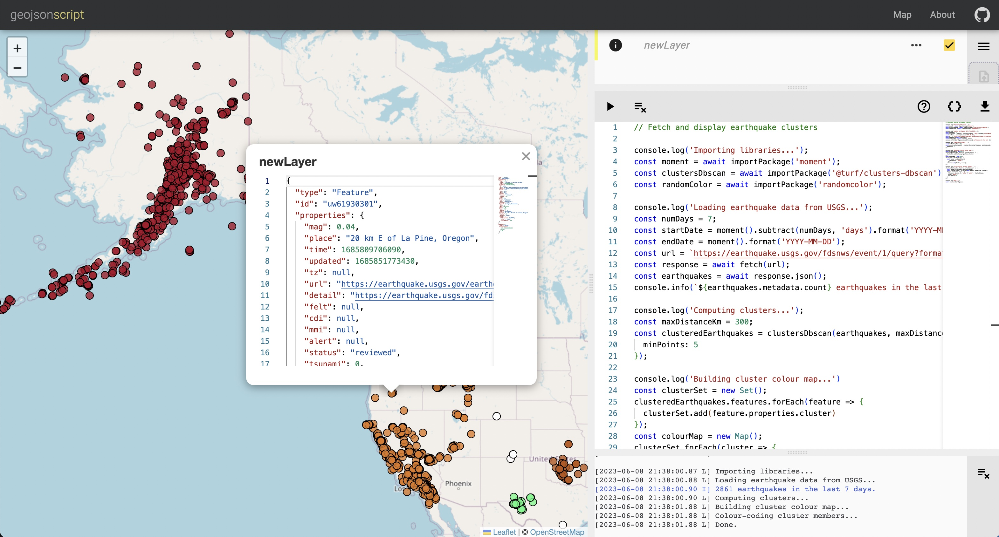

# GeoJSON Script

**Visit [geojsonscript.io](https://geojsonscript.io/about) to use the application and view details about the project.**

GeoJSON Script provides a scripting environment to view and manipulate GeoJSON data.
This project was originally developed during the _Web-based GIS_ course at the University
of Leeds in 2020, and has subsequently been rewritten using [Angular](https://angular.io/).

See [this Gist](https://gist.github.com/anthonydgj/dcc789da461b95e945010d342859b948?permalink_comment_id=4530758#file-spl_example-js) for an example of using SPL.js in the scripting environment.

## Development

Build instructions can be found in the [project README](./geojson-script/README.md).

## License

This project is made publicly available under the MIT license (see the [LICENSE](./LICENSE)
file).